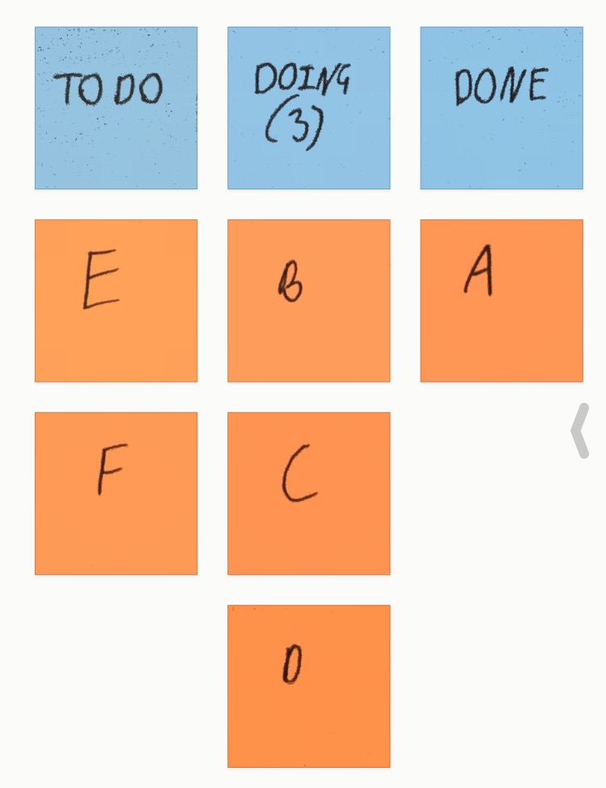
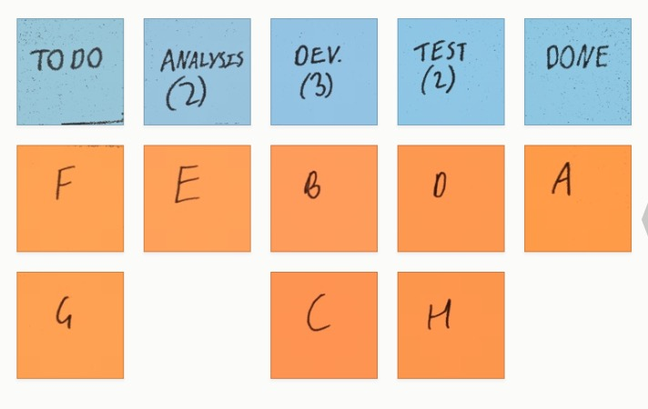
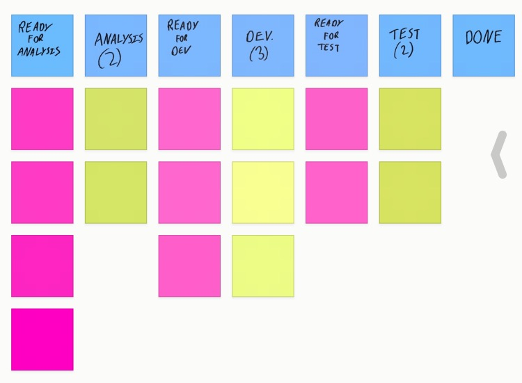
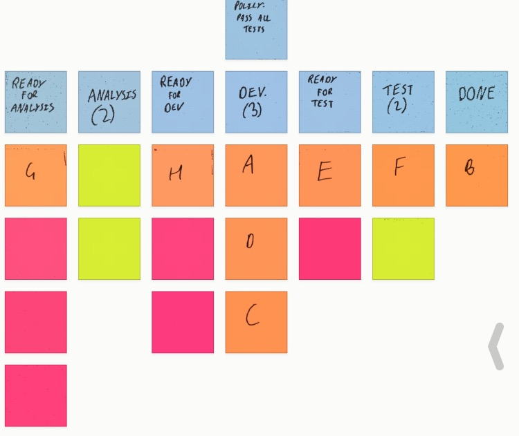
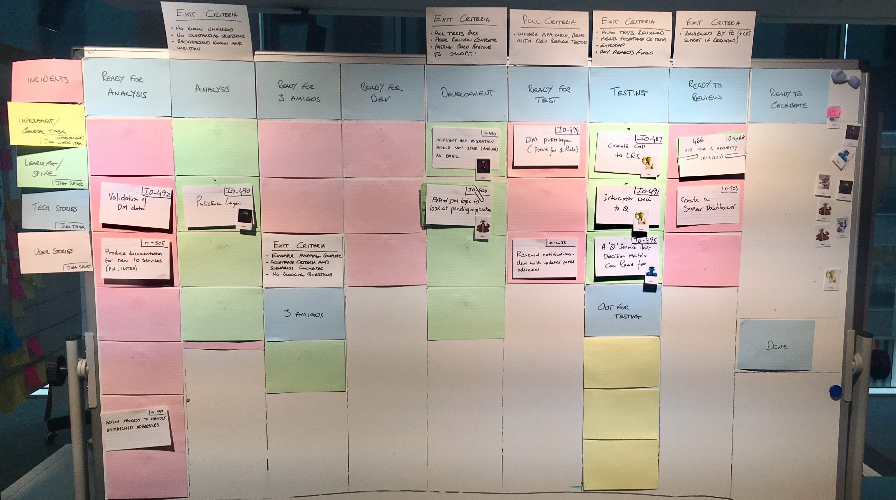

theme: Ostrich, 1

# Evolving Boards

@garyfleming

^ Intro: more informal and less scripted, less prepared

---

# Expectation

^ Expectation: mixed group
Beginners see what kanban board is and how it works.
Intermediate: signals and how to approach them.
Experts: Just a chance to see someone else's board -- I enjoy this.

---

# This Talk Won't Explain Kanban

^ What I'm NOT going to explain is Kanban vs kanban board vs kanban process etc
That's a dull discussion about fairly interesting things, but isn't relevant to
what I'm trying to convey.
So forgive my looseness with language and terminology, and hopefully I can show
you something useful.

---

# What is a Kanban board?

^ Way of visualising the flow of work in order to learn some interesting things.
TODO BULK THIS out
I'm going to frame most of this talk as how a team I work with evolved their board
from something simple to something that was a much better fit. It's mostly true,
with just a few lies to better illustrate points.

---

# Three-Column Kanban

^ Most of the time you should start from where you are: this is try to think about
what your team actually do and create columns that represent that flow. In this case,
we were a new team, so we started from nothing. The most "nothing" board is 3-col.
Simple representation: to-do, doing (3), done. -- meaning

---

# Delivering Value

^ Teams job is to deliver value. They do that by getting items that have been
prioritised has having value done. That means getting it completely, from one
side of the board to another. Not part of the way. The whole way.
TODO fill out

---

# Work-in-Progress (WiP) Limits

^ The "3" in the Doing column is the magic of Kanban. It represents a limit on
the number of items in that column. By doing this we're able to see and manage the flow
of work.
If the WiP limit is reached and we want to do more, it gives us the opportunity,
 the SIGNAL, to have a conversation.
If we learn something new in the process of doing the work, it means we only have
so much in progress that gets wasted if we change our mind.
WiP represents undelivered value. We want to deliver value.
We initially picked 3 because we had 6 developers and we intended to pair.

---

# Getting Serious

^ So that's a good starting point, enough for a lean coffee session, but not really
enough for a real, mixed function team (test, BA, PO etc). Now, as I said, you should start from where you
are but we weren't really anywhere yet. How did we imagine we'd want to start working?
How would work split?
The board was giving us another signal: that we didn't understand our process yet

---

# Conversations...

^ So we had a difficult conversation and realised that we'd need an analysis and
test column. "Doing" wasn't the only kind of doing any more, so we renamed it
dev.

---

# ... And Queues

^ "To-do" was going to have to change. It used to mean "stuff that was waiting for
someone to pick it up, but there were different kinds of being picked up meaning
there should be different kinds of to-do. Hence, we added in queues before active columns

---

# Active columns

^ To help differentiate between the two columns, and to visualise the WiP Limits
we started using coloured index cards. Red for a queue, green for an active column,
number of cards is WiP.

---

# Kanban is a Pull system

^ The queues tell us something: kanban is a pull system. Items wait for people
to pull them into an active column. They are never pushed into work. something
can only be in an active column if someone has made it active by taking ownership
... hence nothing is allowed in active columns unless someone's avatar is on it.

---

# ... Exit Criteria

* "All tests must pass"
* "Code review must be complete, unless pairing"
* "Passing build pipeline to Test environment"

^ That's an example of a policy: "Everything in an active column must have an avatar
belonging to the person who pulled it on it."
When we saw problems, we'd sometimes create new policies.
For Dev, we have exit criteria like

---

# ... Exit Criteria On the Board

^ That's an example of a policy: "Everything in an active column must have an avatar
belonging to the person who pulled it on it."
When we saw problems, we'd sometimes create new policies.
For Dev, we have exit criteria like

---

# Reality

^ A real board. You'll notice it has a bunch more columns.

---

# Ready To Celebrate

^ This came about because we realised our definition of done wasn't quite right: if it's not in production delivering value, it's not done. We wanted to create a new column to hold items that had been tested etc. but were not building up value. When this column fills up, that's a clear signal warning us about undelivered value.

---

# Three Amigos

^ We found a number of items were getting to test and then getting rework or involved conversations. We realised that was because our developers, testers, and product owners weren't all having a conversation upfront. We decided we'd do a three amigos session, using Example Mapping, to make sure everyone understood and could contribute to the shaping of a story ahead of time. This meant far fewer issues later.

---

# Disaster in discovery

^ The board we had worked well for getting work done (in the sense of producing work), but when we moved into a length discovery phase (weeks) we found it didn't work any more. Items would jump around, they'd skip columns, they'd split into different areas etc. No clear joint up definition of whether the discovery work was analysis or dev, or both.
We needed something new...

---

# Solution: Three-Column Kanban

^ It was painful, but the solution was to find a new way of working. Which meant
a new board. We started from scratch. It then evolved some new appendages,
like a "Playback" column for when team members discovered something that should
be shared with the team.
We weren't "Done" until it had been Played Back

---

# Evolve Your Board

^ Note that none of this is software specific: weekly shopping, home moves, HR dept.
Look for pain points, signals, wip breaches. Look for signs things aren't
working. Evolve your board.

---

# Thank You

@garyfleming
