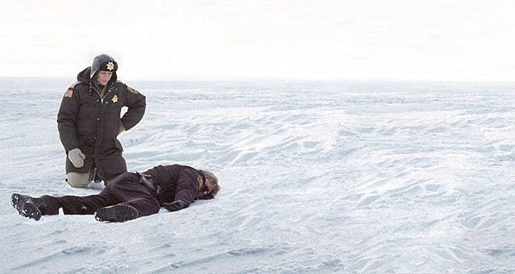
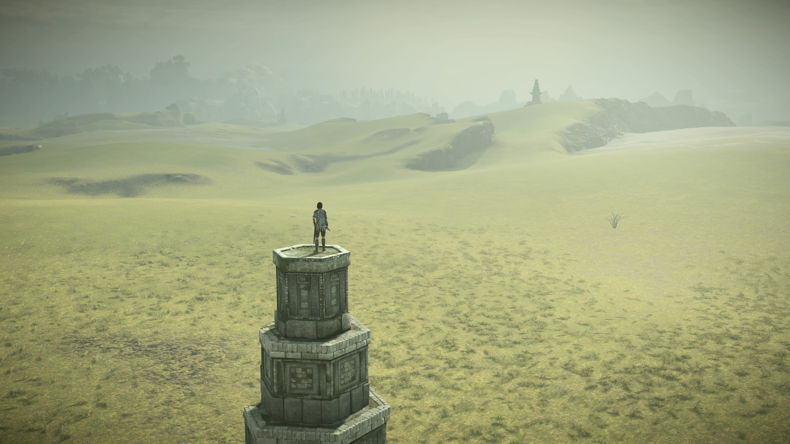
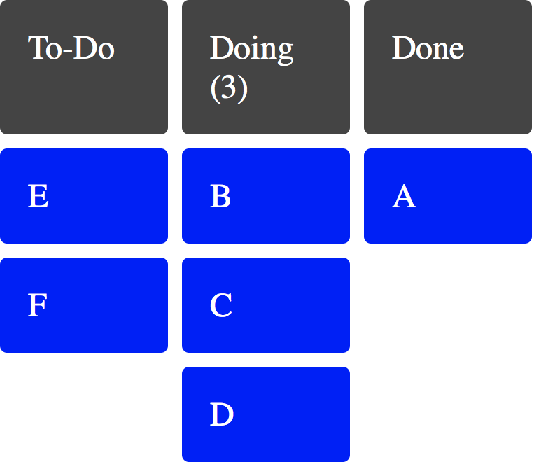
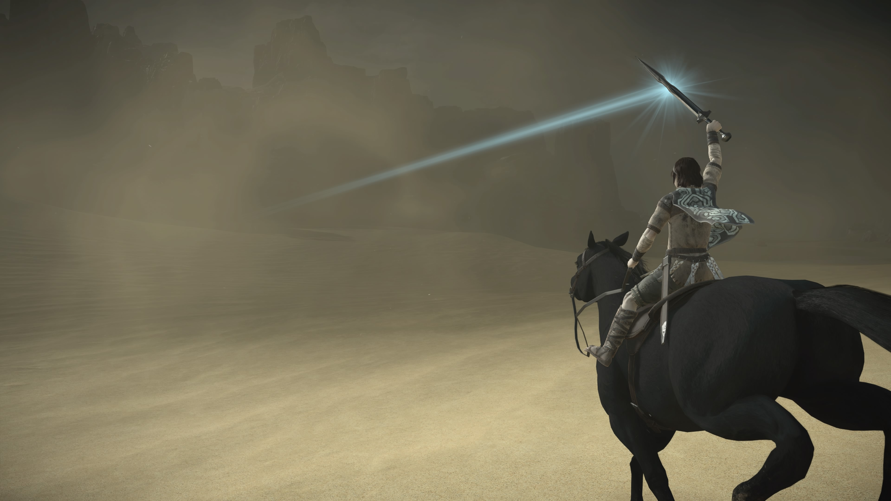
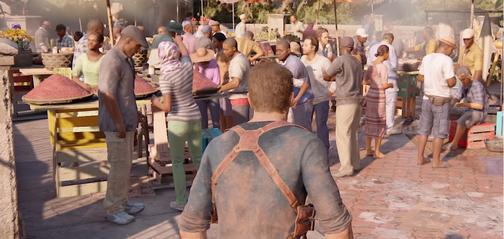
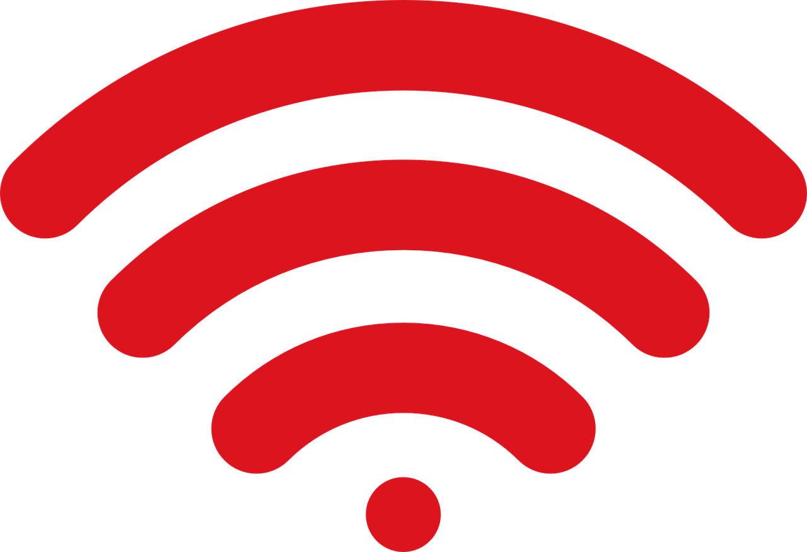
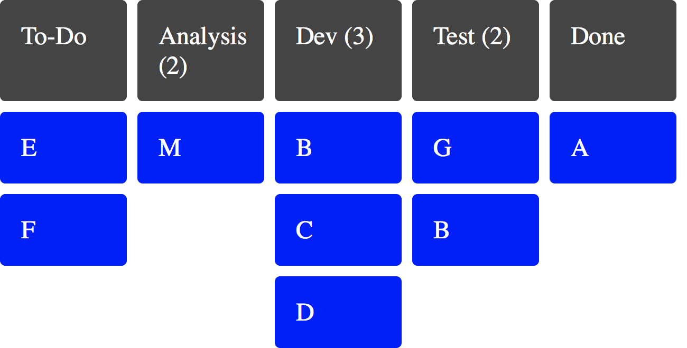
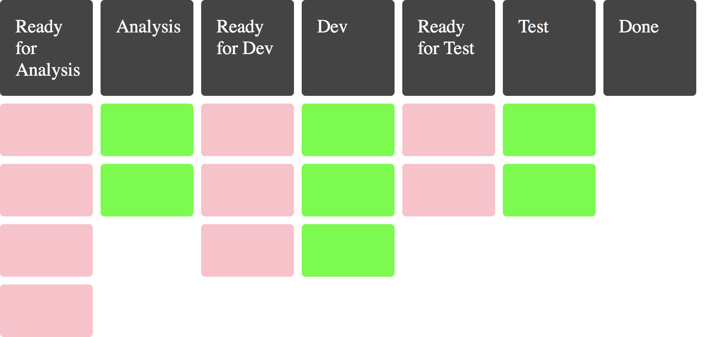
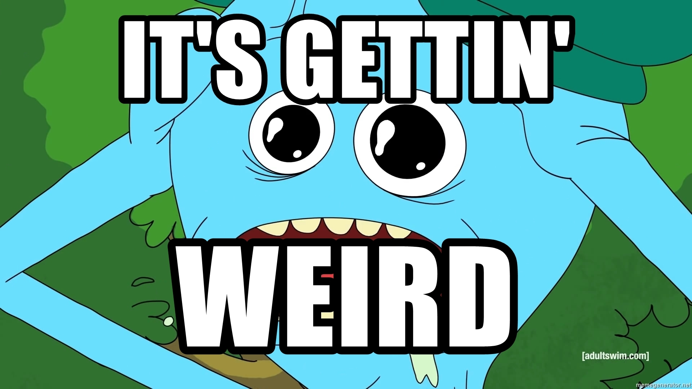
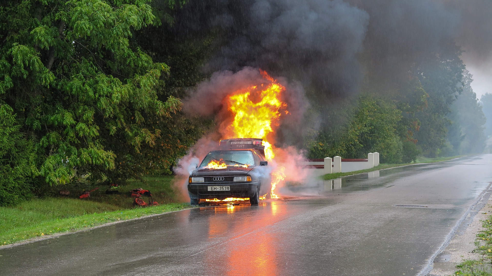

theme: Ostrich, 1

^ TODO Make it clearer how the board **visually** signalled each issue.

^ Hopefully you've been staring at this picture for the last wee while...
^ Georgia O'Keeffe was an artist, whose work was the most expensive painting by a female artist ever sold at auction.
If her name sounds familiar but you don't really follow art, it might be because she was mentioned a fair bit in Season 2 of Breaking Bad by Jesse's girlfriend.
The picture here is called "Red Canna 1919", one of many she painted of flowers and deserts, this one relatively early in her career.
Note the bold shapes and bright colours and the magnified appearance.
Importantly, note the lack of detail. The aesthetic choice here is getting close but staying big picture.

---

> “Nothing is less real than realism. Details are confusing. It is only by selection, by elimination, by emphasis, that we get at the real meaning of things.”

^ O'Keeffe said this...
^ Cool. Now you've had some education in Art History, we can get on with the show

---

# The Board Whisperer

@garyfleming

^ Introduce myself.

---

# The Board Whisperer
## (Roll credits)

@garyfleming

^ Introduce myself.

^ This talk is about boards. Or it's about work. Or it's about how boards show us better ways of working but we mostly ignore them.
^ I was going to create a title image where I took the poster from the film The Horse Whisperer, with Robert Redford, and crudely photoshopped in a whiteboard but... I'm not very good at photoshop

---

# The Stand-Up Dysfunction

^ TODO I like this slide but does it fit exactly here?
^ TODO Way too many points being made here
^ This was made clear to me when observing a number of different teams and seeing how they did standups.
If you squinted they looked kinda like Daily Scrums, as per the Scrum Framework. But if you looked more closely, or understood Scrum/Agile properly, you realised it really wasn't the same thing.
They were going round and asking people the three questions (...) but were really only using it as a progress report.
"What work have we done?", not "How can we ensure we can continue working effectively towards our shared goal?"
It was project management, not anything that generated useful insights.

---

# Boards Offer Insight

^ So I'm going to show you how to use boards to generate insights into making things better with your process and people. How to hear the signals it is sending, and start turning them into change.

---

# Expectation

^ Expectation: mixed group
Who has used a board before? Who would be comfortable setting up a new one for a decent sized team?
Beginners see what kanban board is and how it works.
Intermediate: signals and how to approach them.
Experts: Just a chance to see someone else's board -- I enjoy this.

---

# This Talk Won't Explain Kanban

^ What I'm NOT going to explain is Kanban vs kanban board vs kanban process etc
That's a dull discussion about fairly interesting things, but isn't relevant to
what I'm trying to convey.
So forgive my looseness with language and terminology, and hopefully I can show
you something useful.

<!-- ---

TODO remove this for now. What does it add?
# What is a Kanban board?

^ Way of visualising the flow of work in order to learn some interesting things.
TODO BULK THIS out
I'm going to frame most of this talk as how a team I work with evolved their board
from something simple to something that was a much better fit. It's mostly true,
with just a few lies to better illustrate points. -->

---

# Based on a True Story

^ TODO get a decent based on a true story image. Possibly Fargo?

^ I'm going to tell you about all of this through the true story of a team I worked with. It's all true, but the names have been changed. Also it's really an amalgamation of a few different teams. Also there are parts I might've made up. Other than that, true story.

---

^ So, we formed a new team
^ This is your typical agile team with a PO, BA, Developers, and a tester
Yes, the falcon represents the tester. This is apt.

---

# Green Fields

^ And we had a fairly green field project and environment. Well, I mean, as green fields as things can be in a company that has been around a while. We were clearly standing on some ruins, and we'd been told there were colossal monsters out there but as far as we could see, green fields.

---

# Three-Column Kanban

^TODO New image?
^ TODO remove wip limits from image?
^ Most of the time you should start from where you are: this is try to think about
what your team actually do and create columns that represent that flow. In this case,
we were a new team, so we started from nothing. The most "nothing" board is 3-col.
Simple representation: to-do, doing (3), done. -- meaning

---

# Delivering Value

^ TODO Move this earlier to part about boards/kanban>?
^ Teams job is to deliver value. They do that by getting items that have been
prioritised has having value done. That means getting it completely, from one
side of the board to another. Not part of the way. The whole way.
TODO fill out

---

# Work-in-Progress (WiP) Limits

^ The "3" in the Doing column is the magic of Kanban. It represents a limit on
the number of items in that column. By doing this we're able to see and manage the flow
of work.
If the WiP limit is reached and we want to do more, it gives us the opportunity,
 the SIGNAL, to have a conversation.
If we learn something new in the process of doing the work, it means we only have
so much in progress that gets wasted if we change our mind.
WiP represents undelivered value. We want to deliver value.
We initially picked 3 because we had 6 developers and we intended to pair.

---

# Signals

^ I've mentioned "Signals" a few times now, so it's worth thinking about what that means. The more your board can reflect your work, the more it will help you to see issues.
You need to be attentive

---

[.build-lists: true]

# Signals

* Not positive or negative
* Not necessarily loud
* Attending to one may help you see way more
* Conversations are a MUST!

^ They're just signals.

---

# Physical Boards

^ One of the reasons experienced agile folk tend to prefer physical boards to digital boards (like JIRA) is that they live in your space. The signals are easier to notice because the signals emanate from the board all the time. The more you see it, the more signals you see.
It's much harder to spot the kinds of signal I'll be talking about on a digital board, hence they often degenerate into tracking tools.

---

# Signal: What's the actual process?

^ So that's a good starting point, enough for a lean coffee session, but not really
enough for a real, mixed function team (test, BA, PO etc). Now, as I said, you should start from where you
are but we weren't really anywhere yet. How did we imagine we'd want to start working?
How would work split?
The board was giving us another signal: that we didn't understand our process yet

---

# Solution: Conversations and Columns

^ So we had a difficult conversation and realised that we'd need an analysis and
test column. "Doing" wasn't the only kind of doing any more, so we renamed it
dev.

---

# Signal: TODO

^ At roughly the same time, we realised that
"To-do" was going to have to change. It used to mean "stuff that was waiting for
someone to pick it up, but there were different kinds of being picked up meaning
there should be different kinds of to-do.

---

# Signal: WiP Breaches

^ We also noticed that people weren't well attuned to the WiP limits at the top (the numbers). It was easy to just put things into the column, so while we were showing them the effect of doing that, we also made a tweak (at the same time as the TODO change)

---

# Solution: Active columns

^ Hence, we added in queues before active columns To help differentiate between the two columns, and to visualise the WiP Limits
we started using coloured index cards. Red for a queue, green for an active column,
number of cards is WiP.
We had our queues, and people immediately started feeling weird about putting stuff outside the boundaries of a card.

---

^ ...people immediately started feeling weird about putting stuff outside the boundaries of a card. The WiP limit hadn't changed but it was a tangible and physical thing now. Physicality has power.

<!-- ---

TODO Doesn't make as much sense now. Remove?
# Kanban is a Pull system

^ The queues tell us something: kanban is a pull system. Items wait for people
to pull them into an active column. They are never pushed into work. something
can only be in an active column if someone has made it active by taking ownership
... hence nothing is allowed in active columns unless someone's avatar is on it. -->

---

# Signal: Done, But No Value Yet

^ TODO pull this one for time?
^ TODO done didn't represent work being in the real world. It just meant
the team weren't going to add to it or inspect it for the moment. If we wanted
value, we would have to actually deploy.

---

# Answer: Ready to Celebrate

🎉
🎉🎉
🎉🎉🎉
🎉🎉🎉🎉

^ So we had a conversation and the team saw what we were seeing but decided the board needed somewhere to temporarily park stuff to visualise what was waiting for production.
Limited WiP here would cause blockage further back, incentivising more frequent releases and, quite quickly, a move to CI/CD

<!-- ---

# Signal: Too Much Rework.

^ TODO visual queue? Blocker
^ TODO solution: three amigos. Build shared understanding.
^ FROM OLD VERSION We found a number of items were getting to test and then getting rework or involved conversations. We realised that was because our developers, testers, and product owners weren't all having a conversation upfront. We decided we'd do a three amigos session, using Example Mapping, to make sure everyone understood and could contribute to the shaping of a story ahead of time. This meant far fewer issues later. -->

---

# Signal: "Unfinished" work moving

^ TODO blockers

---

# Answer: Exit Criteria

* "All tests must pass"
* "Code review must be complete, unless pairing"
* "Passing build pipeline to Test environment"

^ That's an example of a policy: "Everything in an active column must have an avatar
belonging to the person who pulled it on it."
When we saw problems, we'd sometimes create new policies.
For Dev, we have exit criteria like

---

# ... Exit Criteria On the Board

^ That's an example of a policy: "Everything in an active column must have an avatar
belonging to the person who pulled it on it."
When we saw problems, we'd sometimes create new policies.
For Dev, we have exit criteria like

---

# Signal: Log Jam In Review

^ TODO visual. Problem. exploration. Solution

---

# Signal: Test Blocking

^ TODO visual. Problem. exploration. Solution

---

# Signal: Waves of Work

^ TODO visual. Problem. exploration. Solution
^ TODO extensive part about cadence

---

# Well-Oiled Machine
## Prelude to a Disaster

^ So months went by and other things changed, but as a team we were working well. We understood the work, we had a smooth process,

---

# Signal: Disaster in Discovery

^ TODO visual. Problem. exploration. Solution
^ The board we had worked well for getting work done (in the sense of producing work), but when we moved into a length discovery phase (weeks) we found it didn't work any more. Items would jump around, they'd skip columns, they'd split into different areas etc. No clear joint up definition of whether the discovery work was analysis or dev, or both.
We needed something new...

<!-- ---

# Signal: XXXXX

^ TODO visual. Problem. exploration. Solution -->

<!-- ---

TODO repurpose these slides in the new format

---

# Solution: Three-Column Kanban

^ Our way of working had materially changed and our board was not working for us any more. It was painful, but the solution was to find a new way of working. Which meant
a new board. We started from scratch. It then evolved some new appendages,
like a "Playback" column for when team members discovered something that should
be shared with the team.
We weren't "Done" until it had been Played Back -->

---

# Evolve Your Board

^ Note that none of this is software specific: weekly shopping, home moves, HR dept.
Look for pain points, signals, wip breaches. Look for signs things aren't
working. Evolve your board.

---

^ TODO come back to the Georgia O'Keeffe quote. Here or a bit earlier.

---

# Thank You

@garyfleming
