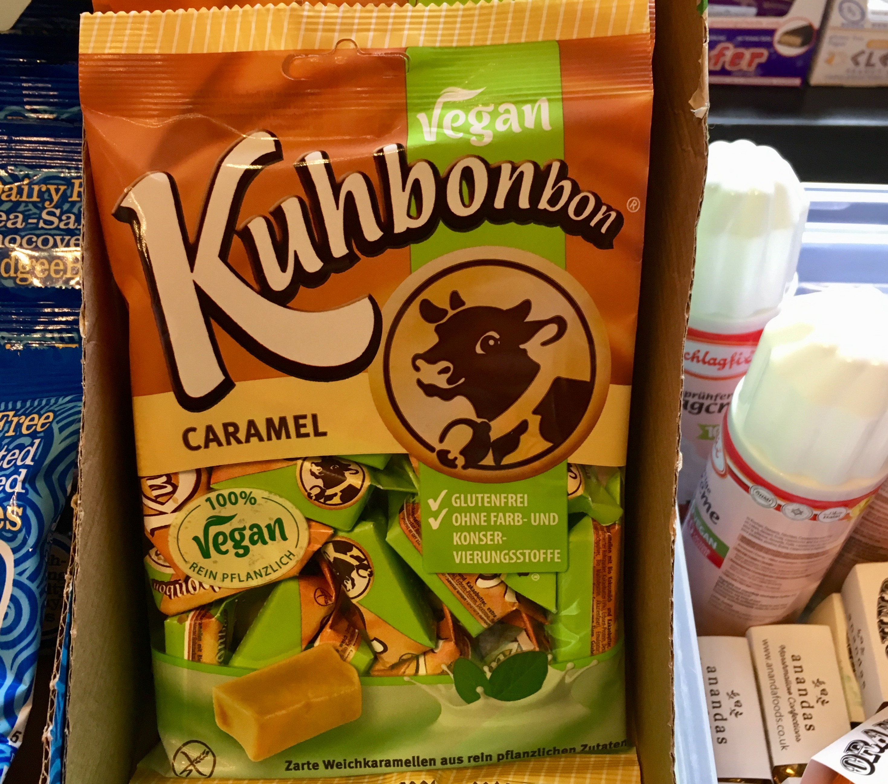

theme: Sketchnote, 1

^ TODO Make it clearer how the board **visually** signalled each issue.
^ TODO maybe describe the talk near the start as being kind of a kata and kind of a catalogue: I'll show you the moves we made when facing different situations so that you can feel the movement. It doesn't meant they're applicable in your situation, but if you can see the thinking maybe you can start to apply that.
^ TODO Split board structure signals and work movement signals into separate halves. Use staging/movement as metaphor here.
^ TODO midway-ish: what we’ve done to this point is flush out our rough process in terms of steps we take. We started somewhere (3-col) and iterated until we got this. Now let’s go looking for other kinds of signals
^ TODO playback and wip blocked markers

^ Hopefully you've been staring at this picture for the last wee while...
^ Georgia O'Keeffe was an artist, whose work was the most expensive painting by a female artist ever sold at auction.
If her name sounds familiar but you don't really follow art, it might be because she was mentioned a fair bit in Season 2 of Breaking Bad by Jesse's girlfriend.
The picture here is called "Red Canna 1919", one of many she painted of flowers and deserts, this one relatively early in her career.
Note the bold shapes and bright colours and the magnified appearance.
Importantly, note the lack of detail. The aesthetic choice here is getting close but staying big picture.

---

> “Nothing is less real than realism. Details are confusing. It is only by selection, by elimination, by emphasis, that we get at the real meaning of things.”

^ O'Keeffe said this...
^ But you're not here for art history education, so let's get started.

---

# The Board Whisperer

@garyfleming

^ Introduce myself. What I do. Title.

---

# The Board Whisperer
## (Roll credits)

@garyfleming

^ I was going to create a title image where I took the poster from the film The Horse Whisperer, with Robert Redford, and crudely photoshopped in a whiteboard but... I'm not very good at photoshop
^ This talk is about boards. Or it's about work. Or it's about how boards show us better ways of working but we mostly ignore them.

---

# The Stand-Up Dysfunction

^ TODO Way too many points being made here
^ This was made clear to me when observing a number of different teams and seeing how they did standups.
If you squinted they looked kinda like Daily Scrums, as per the Scrum Framework. But if you looked more closely, or understood Scrum/Agile properly, you realised it really wasn't the same thing.
They were going round and asking people the three questions (...) but were really only using it as a progress report.
"What work have we done?", not "How can we ensure we can continue working effectively towards our shared goal?"
It was project management, not anything that generated useful insights.

---

# Boards Offer Insight

^ So I'm going to show you how to use boards to generate insights into making things better with your process and people. How to hear the signals it is sending, and start turning them into change.

---

# R U XPRNC'D?

^ Expectation: mixed group
Who has used a board before? Who would be comfortable setting up a new one for a decent sized team?
Beginners see what kanban board is and how it works.
Intermediate: signals and how to approach them.
Experts: Just a chance to see someone else's board -- I enjoy this.

---

^ What I'm NOT going to explain is Kanban vs kanban board vs kanban process etc
That's a dull discussion about fairly interesting things, but isn't relevant to
what I'm trying to convey.
So forgive my looseness with language and terminology, and hopefully I can show
you something useful.

---

# Flow boards

^ So am I talking about? Let's just say flow boards. Just a way of visualising the flow of work in order to learn some interesting things.
^ TODO image of river

---

# Based on a True Story

^ I'm going to tell you about all of this through the true story of a team I worked with. It's all true, but the names have been changed. Also it's really an amalgamation of a few different teams. Also there are parts I might've made up. Other than that, true story.

---

^ So, we formed a new team
^ This is your typical agile team with a PO, BA, Developers, and a tester
Yes, the falcon represents the tester. This is apt.

---

^ And we had a fairly green field project and environment. Well, I mean, as green fields as things can be in a company that has been around a while. We were clearly standing on some ruins, and we'd been told there were colossal monsters out there but as far as we could see, green fields.

---

# Three-Column Kanban

^ TODO remove wip limits from image?
^ Most of the time you should start from where you are: this is try to think about
what your team actually do and create columns that represent that flow. In this case,
we were a new team, so we started from nothing. The most "nothing" board is 3-col.
Simple representation: to-do, doing (3), done.

---

# Delivering Value

^ Teams job is to deliver value. They do that by getting items that have been
prioritised as having value done. That means getting it completely, from one
side of the board to another. Not part of the way. The whole way. There is no partial credit.

---

# Work-in-Progress (WiP) Limits

^ The "3" in the Doing column is the magic of Kanban. It represents a limit on
the number of items in that column. By doing this we're able to see and manage the flow
of work.
If the WiP limit is reached and we want to do more, it gives us the opportunity,
 the SIGNAL, to have a conversation.
If we learn something new in the process of doing the work, it means we only have
so much in progress that gets wasted if we change our mind.
WiP represents undelivered value. We want to deliver value.
We initially picked 3 because we had 6 developers and we intended to pair.

---

# Signals

^ I've mentioned "Signals" a few times now, so it's worth thinking about what that means. The more your board can reflect your work, the more it will help you to see issues.
You need to be attentive to places where your board isn't giving you enough information to do the work well, or is giving you far too much and drowning you in details.

---

[.build-lists: true]

# Signals

* Not positive or negative
* Not necessarily loud
* Attending to one may help you see way more
* Conversations are a MUST!

^ They're just signals.

---

# Physical Boards Are Signalling

^ One of the reasons experienced agile folk tend to prefer physical boards to digital boards (like JIRA) is that they live in your space. The signals are easier to notice because the signals emanate from the board all the time. The more you see it, the more signals you see.
It's much harder to spot the kinds of signal I'll be talking about on a digital board, hence they often degenerate into tracking tools.

---

# Digital Boards are Analytical

^TODO image: analytical. Maybe an old-skool robot?

^ the signals we get are visual. You could possibly achieve the same thing on a digital board, analysing and scrutinising the numbers, but takes longer. Requires more work. Tendency towards shallow analytical thinking (as opposed to having conversations)
^ They've done analytical work to find issues, so they are biased towards seeing it as a solution.

---

# Signal: What's the actual process?

^ So that's a good starting point, enough for a lean coffee session, but not really
enough for a real, mixed function team (test, BA, PO etc). Now, as I said, you should start from where you
are but we weren't really anywhere yet. How did we imagine we'd want to start working?
How would work split?
The board was giving us another signal: that we didn't understand our process yet

---

# Solution: Conversations and Columns

^ So we had a difficult conversation and realised that we'd need an analysis and
test column. "Doing" wasn't the only kind of doing any more, so we renamed it
"dev".

---

# Signal: TODO

^ At roughly the same time, we realised that
"To-do" was going to have to change. It used to mean "stuff that was waiting for
someone to pick it up, but there were different kinds of being picked up meaning
there should be different kinds of to-do.

---

# Signal: WiP Breaches

^ We also noticed that people weren't well attuned to the WiP limits at the top (the numbers). It was easy to just put things into the column, so while we were showing them the effect of doing that, we also made a tweak (at the same time as the TODO change)

---

# Solution: Active columns

^ Hence, we added in queues before active columns To help differentiate between the two columns, and to visualise the WiP Limits
we started using coloured index cards. Red for a queue, green for an active column,
number of cards is WiP.
We had our queues, and people immediately started feeling weird about putting stuff outside the boundaries of a card.

---

^ ...people immediately started feeling weird about putting stuff outside the boundaries of a card. Without any further intervention, people breached WiP way less often and, if someone did, the team would ask them to fix it. The WiP limit hadn't changed but it was a tangible and physical thing now. Physicality has power.

---

# Signal: Done, But No Value Yet

^ TODO pull this one for time?
^ "Done" didn't represent work being in the real world. It just meant
the team weren't going to add to it or inspect it for the moment. If we wanted
value, we would have to actually deploy.

---

# Answer: Ready to Celebrate

🎉🎉🎉🎉🎉🎉🎉🎉🎉🎉🎉🎉🎉🎉🎉🎉🎉🎉🎉🎉🎉🎉🎉🎉🎉🎉🎉
🎉🎉🎉🎉🎉🎉🎉🎉🎉🎉🎉🎉🎉🎉🎉🎉🎉🎉🎉🎉🎉🎉🎉🎉🎉🎉🎉
🎉🎉🎉🎉🎉🎉🎉🎉🎉🎉🎉🎉🎉🎉🎉🎉🎉🎉🎉🎉🎉🎉🎉🎉🎉🎉🎉
🎉🎉🎉🎉🎉🎉🎉🎉🎉🎉🎉🎉🎉🎉🎉🎉🎉🎉🎉🎉🎉🎉🎉🎉🎉🎉🎉
🎉🎉🎉🎉🎉🎉🎉🎉🎉🎉🎉🎉🎉🎉🎉🎉🎉🎉🎉🎉🎉🎉🎉🎉🎉🎉🎉
🎉🎉🎉🎉🎉🎉🎉🎉🎉🎉🎉🎉🎉🎉🎉🎉🎉🎉🎉🎉🎉🎉🎉🎉🎉🎉🎉
🎉🎉🎉🎉🎉🎉🎉🎉🎉🎉🎉🎉🎉🎉🎉🎉🎉🎉🎉🎉🎉🎉🎉🎉🎉🎉🎉
🎉🎉🎉🎉🎉🎉🎉🎉🎉🎉🎉🎉🎉🎉🎉🎉🎉🎉🎉🎉🎉🎉🎉🎉🎉🎉🎉
🎉🎉🎉🎉🎉🎉🎉🎉🎉🎉🎉🎉🎉🎉🎉🎉🎉🎉🎉🎉🎉🎉🎉🎉🎉🎉🎉
🎉🎉🎉🎉🎉🎉🎉🎉🎉🎉🎉🎉🎉🎉🎉🎉🎉🎉🎉🎉🎉🎉🎉🎉🎉🎉🎉
🎉🎉🎉🎉🎉🎉🎉🎉🎉🎉🎉🎉🎉🎉🎉🎉🎉🎉🎉🎉🎉🎉🎉🎉🎉🎉🎉

^ So we had a conversation and the team saw what we were seeing but decided the board needed somewhere to temporarily park stuff to visualise what was waiting for production.

---

# Answer: Ready to Celebrate

^ TODO image illustrating ready to celebrate

^ Limiting WiP here would cause blockage further back, incentivising more frequent releases and, quite quickly, a move to CI/CD

---

# Signal: Too Much Rework.

^ Visual: we found a number of items were getting to test and then getting more rework. We could see this in the developers owning stuff in the test column, or in the blockers.
Or worse: when the tester said it didn't do X, Y, or Z, the response was the awful...

---

# Signal: Too Much Rework.

## "THAT WASN'T IN THE REQUIREMENTS."

^ Have you ever heard that before?
^ Let's be clear: this usually happens when developers take a blinkered view of development. Spec-in, build-thing, software-out. It's usually caused by the system and pressures around them, but it's not true of modern Agile development. There is a real problem here.

---

# Answer: Three Amigos

## 🧐🤓😇

^ TODO image: three amigos board!
^ The way we get passed this is by having conversations. You need some Three Amigos at the start. You can pick your methodology as you like but you can avoid these kinds of blockers by having a three-way conversation between a developer, tester, and product owner (or sometimes BA) upfront. Make sure everyone understood and could contribute to the shaping of a story ahead of time. This meant far fewer issues later.

---

# Three Amigos: Example Mapping

## examplemapping.com

^ You can use whatever method you like for these conversations. Right now, I really like Example Mapping, which was created by Matt Wynne. I don't have time to go into it now, but if you go to examplemapping.com you'll get taken to his original blog post on the matter.

---

# Useful signal: Three Amigos Bottleneck

^ TODO image: three amigos board!
^ It's also worth calling out a signal we were inserting into the board here: there is no queue column between Analysis and Three Amigos. We decided to make it explicit in our process that the conversation was important and should happen as a priority. Not being able to queue does that.

---

# Useful signal: Three Amigos Bottleneck

^ If something sits in Three Amigos for any length of time, the bottleneck forms and we see that communication isn't working the way we wanted. We have a conversation.

---

# Signal: "Unfinished" work moving

^ TODO blockers

---

# Answer: Exit Criteria

* "All tests must pass"
* "Code review must be complete, unless pairing"
* "Passing build pipeline to Test environment"

^ That's an example of a policy: "Everything in an active column must have an avatar
belonging to the person who pulled it on it."
When we saw problems, we'd sometimes create new policies.
For Dev, we have exit criteria like....

---

# Shared Ownership through Conversations

^ TODO image: hmm... ownership? collaboration? conversation?
^ Importantly, and predictably, how do we come up with exit criteria? We have a conversation. The team, as a whole, agrees on the criteria and enforces it collectively. Shared ownership through conversations. It's hard to feel like you own something if you didn't have input into the rules.

---

# ... Exit Criteria On the Board

^ TODO image: exit criteria
^ That's what that looks like on the board.

---

^ TODO write something about this painting
^ Oh, wait, What's this? Well, I guess I'll tell you a bit about this painting...

^ But you're not here hear about art history..

---

# Signal: Log Jam In Review

^ TODO logjam board
^ Visual: Review became a bottleneck. Things were backing up a lot behind it.
Someone immediately suggested increasing the WiP limit. Nearly got actioned.
When we had a conversation about why it happened, it was because people hadn't prioritised it. They hadn't prioritised it, even though it was towards the right of the board, because they weren't clear who exactly should be involved. Some times it was the BA, sometimes the PO. Sometimes it was the developer who walked them through, sometimes the tester. What we actually needed was a better but flexible policy that made it clear.

---

# What if... WiP Had Been Increased?

^ It does raise the question: what would have happened if we had just ploughed ahead and gone with that first obvious solution: what if we increased WiP to remove the blockage?
It's hard to be certain because we didn't do it, but it probably wouldn't have helped. We'd go from having 2 things blocked in review to mostly having 3 things blocked, with the same systemic problem (i.e. people not understanding their responsibility) plagueing us... but a little bigger.

---

# "What should the WiP limits be for column X?"

## 1?

^ TODO an aside into WiP for a little more shape.
^ I've talked about WiP limits a couple of times during this and something I've been asked very often is: "What should the WiP limits be for this column?". Sometimes it's "What should the WiP limits be for this column with these people constraints?". Either way, I have no idea. Really I don't. It's contextual. I know people who have argued that the ideal WiP is 1, right across the board. The idea being that each person does their part, passes to the right and pulls from the left in perfect harmony (TODO pic!). That has some truth in it but fails in reality.

---

[.build-lists: true]

# "What should the WiP limits be for column X?"

Affected by:

* Slicing of task,
* Complexity of task,
* The stage of work (Dev vs test etc)
* The people doing the work.

etc.

^ Why? The things we work on just aren't that evenly sliced. We should aim for small even slices, but few teams work well enough to nail this. Aiming for small is good. More importantly, the things we work on don't usually take the same length of time. Analysis, development, testing. It's unlikely they'll all take exactly the same length of time on a task, or even out over time. To be clear, I'm not saying one takes longer than the others: it's very task contextual.
Plus people aren't resources. They can't be interchanged. Different people will take different amounts of time to do the same thing for a while heap of reasons. And even that will vary day to day, dependant on external factors like mood, the weather etc. Don't worry about it.

---

# Signal: Test Blocking

^ TODO SPLIT visual. Problem. exploration. Solution
^ Things started taking ages in test. Tickets which had been taking a half-day were now taking several days. The effect of this was that the ready for test column filled up and dev backlogged. Why?
^ Someone quickly solutionised and said we should get another tester to help with the work. Two people would half the amount of work... this was despite the fact that devs in our team would often do test work. We probably weren't facing a sizing problem.
^ So... we had a conversation. It became clear that the tester was taking longer to test because they were having to setup a whole bunch of different things in an isolated environment to properly test. Why was that different than before?
^ Well, we had switched from one architectural style (REST APIs) to something else (event-driven over message queues). When we made that change, the developers hadn't created any affordances that would make test easy. System visibility had been lowered. We realised immediately if system visibility was lowered to a tester, then it was going to be difficult to operate in a production environment.
^ The ultimate solution: actually just spend a bit of time thinking about this as part of analysis. During three amigos, a new question would be asked: "How do we test this?" That way the devs could build something that was testable, and the testers could raise concerns.

---

# Signal: Waves of Work

^ TODO visual. Problem. exploration. Solution
^ TODO extensive part about cadence
^ Here's a very visual signal: we started to notice waves passing across the board. Not just any waves. Anti-waves. Gaps. One day analysis would be empty, then dev, then test etc. As queues emptied and work got done, we could see fairly consistent but somewhat random movement across the board. This manifested itself most notably in the ready for analysis column (our input) draining, going empty, and then suddenly refilling. Over and over.
^ When we had the conversation, we talked a lot about flow. About the elements that were causing this lack of flow, and how we could tackle it. There were a few things at play, but the RfA column was key. It was filling weirldy because our two-week cadence wasn't right for us. We were chewing through things quicker.
^ So let's lower cadence by a few days? How about we just get rid of it? How about we use the board as our signal? The BA/PO are usually looking at what should be next anyway, so how about rather than wait two weeks, we just keep an eye on the board for the signal that we'd need more soon.
^ We removed cadence. Gone. We realised  we didn't really need it any more. We were delivering every commit to production already, we *always* had working software, our planning moved to just-in-time. So what was "two weeks" doing for us? Nothing. Absolutely nothing.
^ TODO much longer bit about cadence.
^

---

# Well-Oiled Machine
## Prelude to a Disaster

^ So months went by and other things changed, but as a team we were working well. We understood the work, we had a smooth process, and things generally worked. It was a good time.

---

# Signal: Disaster in Discovery

^ TODO visual. Problem. exploration. Solution
^ The board we had worked well for getting work done (in the sense of producing work), but when we moved into a length discovery phase (weeks) we found it didn't work any more. Items would jump around, they'd skip columns, they'd split into different areas etc. No clear joint up definition of whether the discovery work was analysis or dev, or both.
We needed something new...

---

# Solution: Three-Column Kanban

^ Our way of working had materially changed and our board was not working for us any more. It was painful, but the solution was to find a new way of working. Which meant
a new board. We started from scratch.

---

# Starting a new Journey

^ Starting from scratch is hard. You've invested a lot of time in effort to make your boards work for you. But you have to be willing to kill your darlings when the board is yelling at you that it doesn't work any more.

---

# Signal: Done in Discovery?

^ What did done mean in discovery now? It didn't mean that it was live and adding value. It meant that we had discovered something. But we found things would move to "Done" and then other team members would ask for an explanation, so they could build on that work. It wasn't really done.

---

# Solution: Playback

^ TODO
like a "Playback" column for when team members discovered something that should
be shared with the team.
We weren't "Done" until it had been Played Back

---

# Back to Big

^ TODO back to big board. Playback came too

<!--

# Signal: XXXXX

^ TODO visual. Problem. exploration. Solution -->

---

# Evolve Your Board

^ Look for pain points, signals, wip breaches. Look for signs things aren't
working. Evolve your board.

---

# Just enough. Not perfect.

^ TODO image. general semantics? the pipe one, maybe?
^ There are all sorts of ways to tweak your board, but you have to remember that it's always an abstraction. It's there to help you work. It is not, itself the work.

---

[.build-lists: true]

# The real work is...

* Individuals & Interactions
* Collaboration
* Responding to change
* Producing working software

^ The real work lies not in the tasks but in the messy communication around the tasks.
^ It lies in the change.
^ The real work is in producing working software ONCE we've had a chat about what working software actually is.
^ I sincerely hope that list sounds familiar...

---

# The board helps by

* Removing confusing details.
* By Selecting.
* By Elimination.
* By Emphasising.
* By getting at the real meaning of things.

^ The board helps by removing confusing details, by allowing us to select and focus, eliminating and emphasising. We can see the real meaning in our work.
^ To put that another way...

---

---

## “Nothing is less real than realism. Details are confusing. It is only by selection, by elimination, by emphasis, that we get at the real meaning of things.”

---

# Thank You

@garyfleming
